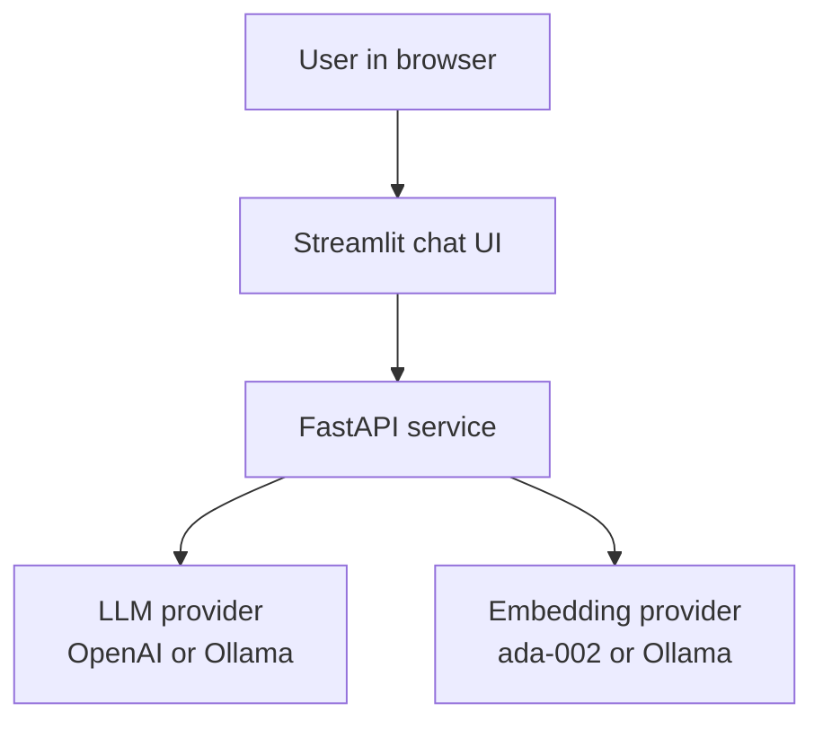
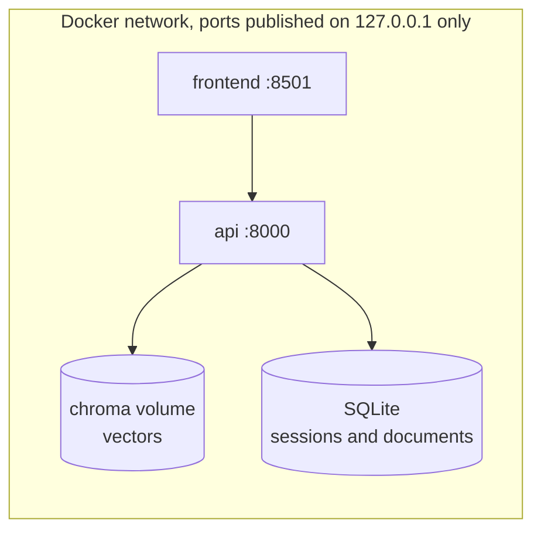
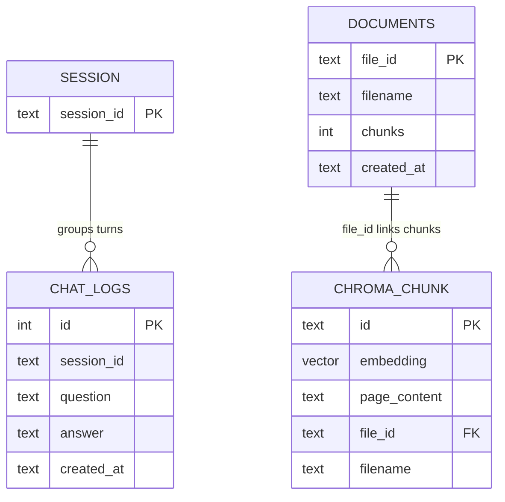
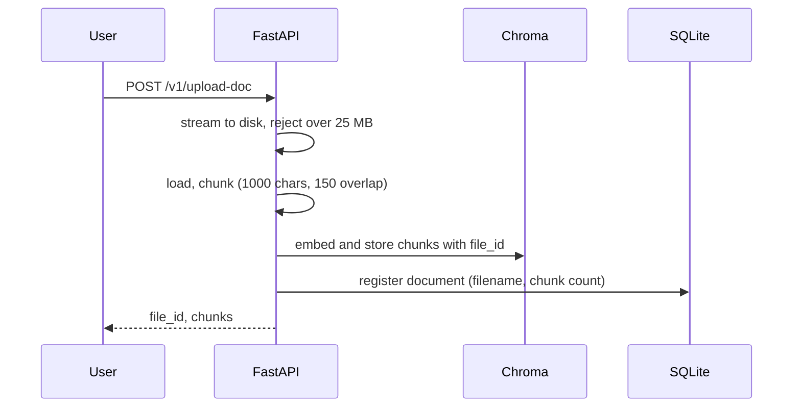
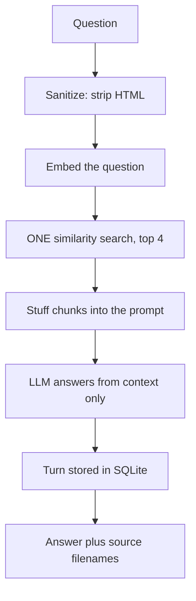
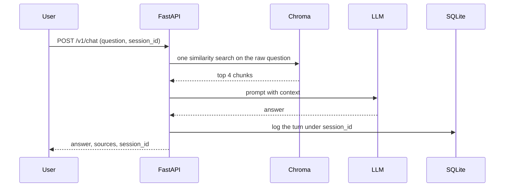

# rag-naive-2022

**A retrieval augmented generation service for question answering over your own documents. The Naive (2022) rung, the baseline the whole RAG line is measured against.**

Part of the RAG line, a series of reference enterprise RAG implementations, one per retrieval strategy. This repository is the Naive (2022) rung. See [the full line](#the-rag-line) below.

[](https://github.com/mlvpatel/rag-naive-2022/actions/workflows/ci.yml)   


The clip above is a live, unedited run on a local llama3.2 model with the bundled sample data, including a real SEC 10-K, indexed in Chroma. No paid keys were used. Full recording at [assets/videos/rag-naive-2022-demo.webm](assets/videos/rag-naive-2022-demo.webm), screenshot at [assets/screenshots/rag-naive-2022-ui.png](assets/screenshots/rag-naive-2022-ui.png).

## Contents

- [Why the naive baseline matters](#why-the-naive-baseline-matters)
- [Tech stack](#tech-stack)
- [Architecture](#architecture)
- [Data model](#data-model)
- [How ingestion works](#how-ingestion-works)
- [How a question is answered](#how-a-question-is-answered)
- [Memory](#memory)
- [The mathematics](#the-mathematics)
- [How to use](#how-to-use)
- [Configuration](#configuration)
- [API reference](#api-reference)
- [A note on access](#a-note-on-access)
- [Testing](#testing)
- [Project structure](#project-structure)
- [The RAG line](#the-rag-line)

## Why the naive baseline matters

rag-naive-2022 is the starting point of the line: embed the question, search a vector store once, put the top matches into the prompt, generate. No hybrid search, no reranking, no query rewriting. It is packaged as a real service, FastAPI, a Streamlit chat interface, multi user sessions, and Docker, so it runs like production while the retrieval stays honestly naive.

That honesty is the point. Every later rung exists because this one fails somewhere specific: exact tokens (an error code, a defined term) slip past dense similarity, follow-up questions arrive as unresolved pronouns, and one retrieval pass has no way to notice it failed. When a harder question gets a shallow answer here, you are looking at the exact limits that hybrid search, reranking, reformulation, and self correction address in the rungs above.

## Tech stack

| Component | Choice | Why this one |
|---|---|---|
| API | FastAPI | Async, typed, OpenAPI for free |
| Vector store | ChromaDB (embedded) | Zero infra: the store lives in a local directory |
| Embeddings | OpenAI ada-002 or Ollama nomic-embed-text | ada-002 is the authentic 2022 default; Ollama keeps it keyless |
| Generation | OpenAI or Ollama | Routed by model name |
| Chunking | Recursive splitter, 1000 chars, 150 overlap | The textbook 2022 parameters |
| Memory | SQLite (WAL mode) | A session log with zero infra |
| UI | Streamlit | A chat surface in one file |
| Packaging | Docker Compose, non-root, loopback ports | Runs like production without pretending to be exposed |
| CI | GitHub Actions | Lint, tests, pip-audit |

## Architecture

System context:



Containers: two services, one volume, everything published on loopback only.



## Data model



`file_id` is stamped into every chunk's metadata at index time, which is what makes deletion exact: removing a document deletes precisely its chunks.

## How ingestion works

Naive means synchronous: the upload request itself chunks, embeds, and stores. No queue, no worker, which is exactly what makes the flow readable and exactly what stops scaling (the async worker is a later rung's idea).



## How a question is answered



One search, no second opinion. The chain does not reshape the question from earlier turns either; reformulating a follow-up into a standalone query is a 2023 technique and deliberately absent here.

## Memory

Every turn is stored under a `session_id`, windowed to the last 20 turns on read. The log is write-mostly at this rung: naive RAG does not use history to reshape the query, so the session log exists precisely so the next rung can.



## The mathematics

**Embedding and similarity.** A chunk and a query become vectors, and closeness is cosine similarity:

$$\text{sim}(\mathbf{q}, \mathbf{d}) = \frac{\mathbf{q} \cdot \mathbf{d}}{\lVert \mathbf{q} \rVert \, \lVert \mathbf{d} \rVert}$$

Chroma stores the equivalent cosine distance $d_{\cos} = 1 - \text{sim}$ and returns the nearest chunks first.

**The whole retrieval strategy.** Everything this rung does at query time is one expression:

$$\text{context}(q) = \underset{d \in \text{chunks}}{\arg\,\text{top-}k}\; \text{sim}\big(f(q), f(d)\big), \qquad k = 4$$

with a single embedding function $f$ for both sides. That single $f$ is a real, measurable weakness: a question and the passage answering it are not paraphrases, and one map must serve both. The asymmetric task-typed embeddings that fix this arrive at the next rung.

**Chunking.** With chunk size $c = 1000$ characters and overlap $o = 150$, a document of length $L$ yields approximately

$$n \approx \left\lceil \frac{L - o}{c - o} \right\rceil$$

chunks. The overlap exists so a sentence straddling a boundary appears whole in at least one chunk.

**Where the math runs out.** There is no second scoring function to disagree with the first, so there is nothing to fuse and nothing to rerank; the rungs above add exactly those terms (BM25, RRF, a cross encoder) one at a time. Keeping this rung minimal is what makes each later term's contribution measurable.

## How to use

### Docker Compose (full stack)

```bash
cp .env.example .env
# edit .env: set OPENAI_API_KEY, or configure Ollama for a local run
docker compose -f docker/docker-compose.yml up --build -d
open http://localhost:8501      # the chat UI
# API docs at http://localhost:8000/docs
```

### Local, fully offline with Ollama (no paid keys)

```bash
# 1. Start Ollama and pull the models
ollama serve &
ollama pull nomic-embed-text
ollama pull llama3.2:3b

# 2. Install and run
make install
EMBEDDING_PROVIDER=ollama LLM_MODEL=llama3.2:3b make dev    # API on :8000
make frontend                                               # UI on :8501, second terminal
```

Upload a document in the sidebar and ask a question. The answer comes back grounded in your document.

### Try it with the bundled sample data

The repo ships with sample documents in [sample_data](sample_data), an HR handbook, a product FAQ, and a real SEC 10-K excerpt, so you can run and judge the system without supplying your own files. With the service running:

```bash
make load-samples
```

Then ask the questions listed in [sample_data/README.md](sample_data/README.md), including an honesty check where it should decline to answer rather than guess.

## Configuration

Settings come from environment variables, see `.env.example`.

| Setting | Default | Meaning |
|---|---|---|
| EMBEDDING_PROVIDER | openai | openai or ollama |
| EMBEDDING_MODEL | text-embedding-ada-002 | OpenAI embedding model |
| LLM_MODEL | gpt-3.5-turbo | gpt names use OpenAI, llama names use Ollama |
| CHROMA_DIR | ./chroma_db | Chroma persistence directory |
| TOP_K | 4 | Chunks retrieved for the prompt |
| CHUNK_SIZE / CHUNK_OVERLAP | 1000 / 150 | Chunking parameters |
| CORS_ORIGINS | http://localhost:8501 | Allowed browser origins |
| MAX_UPLOAD_MB | 25 | Rejected above this size |

## API reference

| Method and path | Purpose | Limit |
|---|---|---|
| GET /health | Liveness | none |
| POST /v1/chat | Naive RAG answer with session logging | 30/min |
| POST /v1/upload-doc | Upload and index a document | 6/min, 25 MB |
| GET /v1/list-docs | List indexed documents | none |
| POST /v1/delete-doc | Delete a document and its chunks | none |

## A note on access

The service has no authentication, and that is a decision rather than an omission. It is a reference implementation meant to run on one machine, so Compose maps both ports to `127.0.0.1` and the container runs as an unprivileged user. A shipped default credential would be the worse option: it reads as protection while sitting in a public repository for anyone to read. What remains is real, per route rate limiting, a size cap on uploads, HTML stripping on input, and a narrow CORS origin. Put an authenticating gateway in front of it before binding it to anything wider than loopback.

## Testing

```bash
make test        # unit tests
```

Unit tests cover sanitization, configuration, and chunking. An integration test indexes a document and retrieves from it with real embeddings, and runs only when Ollama is reachable.

## Project structure

```
src/api/          FastAPI app, endpoints, security, SQLite session memory
src/core/         config, the naive RAG chain, logging
src/embeddings/   Chroma vector store and embedding providers
frontend/         Streamlit chat UI
sample_data/      runnable sample documents
scripts/          sample data loader
tests/            unit and integration tests
docker/           Dockerfile and Compose stack
```

## The RAG line

This repo is the Naive (2022) rung. Each rung adds one idea and keeps the ones below it.

| Year | Repository | Strategy |
|---|---|---|
| 2022 | rag-naive-2022, this repo | Naive: one dense search over Chroma |
| 2023 | [rag-advanced-2023](https://github.com/mlvpatel/rag-advanced-2023) | Advanced: hybrid, RRF and cross encoder, in Python |
| 2023 | [rag-modular-2023](https://github.com/mlvpatel/rag-modular-2023) | Modular: pgvector, RRF in SQL, streaming, memory, evaluation |
| 2024 | [rag-graph-2024](https://github.com/mlvpatel/rag-graph-2024) | Graph: entity and triple knowledge graph linked into answers |
| 2024 | [rag-cache-2024](https://github.com/mlvpatel/rag-cache-2024) | Cache: no retrieval, corpus in context with a semantic cache |
| 2025 | [rag-agentic-2025](https://github.com/mlvpatel/rag-agentic-2025) | Agentic: bounded self correcting loop, confidence gated |
| 2026 | [rag-multiagent-2026](https://github.com/mlvpatel/rag-multiagent-2026) | Multi agent: supervisor, specialists, verifier |
| 2026 | [rag-multimodal-2026](https://github.com/mlvpatel/rag-multimodal-2026) | Multimodal: text and images in one vector space |

## Author

Malav Patel. GitHub [@mlvpatel](https://github.com/mlvpatel).

## License

Released under the MIT License. See [LICENSE](LICENSE).
