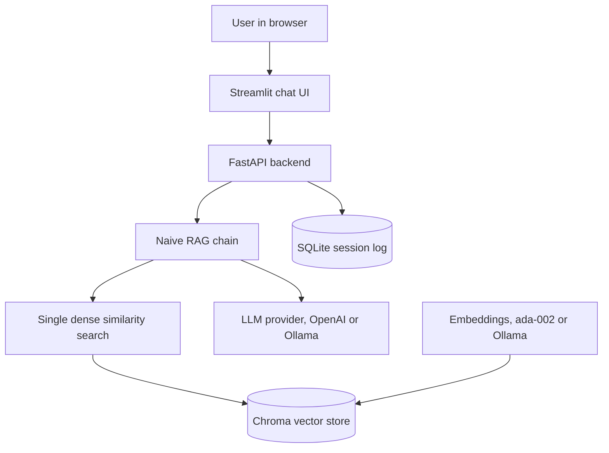
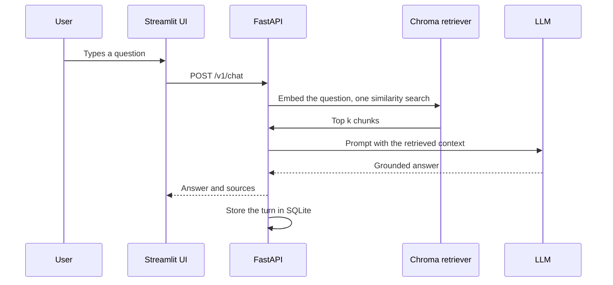

# RagFlow

**A retrieval augmented generation service for question answering over your own documents. The naive baseline of the RagFlow line, 2022 generation.**

**Part of the RagFlow line, a series of reference enterprise RAG implementations. This repository is RagFlow, Naive RAG.** See [the full line](#the-ragflow-line) below.

RagFlow answers questions about your documents with the original 2022 RAG pattern: embed the question, search a vector store once, put the top matches into the prompt, and generate a grounded answer. No hybrid search, no reranking, no query rewriting. It is packaged as a real service, FastAPI, a Streamlit chat interface, multi user sessions, and Docker, so it runs like production while the retrieval stays honestly naive.

[](https://github.com/mlvpatel/RagFlow/actions/workflows/ci.yml)   


The clip above is a live, unedited run on a local llama3.2 model with the bundled sample data, including a real SEC 10-K, indexed in Chroma. No paid keys were used.

**Full recording and a still:** the screen recording is at [assets/videos/ragflow-demo.webm](assets/videos/ragflow-demo.webm), and a screenshot is at [assets/screenshots/ragflow-ui.png](assets/screenshots/ragflow-ui.png).

## Why the naive baseline matters

RagFlow is the starting point of the line. It shows the core RAG idea in its simplest honest form, so every later implementation has a clear before to compare against. When a harder question gets a shallow answer, that is the naive baseline showing its limits, the very limits that hybrid search and reranking address in RagFlowPlus 2023 and the implementations beyond it.

## Features

| Area | Capability |
|---|---|
| Retrieval | A single dense similarity search over Chroma, no reranking, the 2022 pattern |
| Embeddings | OpenAI ada-002, or local Ollama nomic-embed-text |
| Generation | OpenAI, or local Ollama, chosen by model name |
| Sessions | Multi user conversation log stored in SQLite |
| Documents | Upload, list, and delete; text and PDF |
| Security | API key auth, rate limiting, input sanitization, CORS |
| Packaging | Docker Compose for the full stack, unit and integration tests, CI |

## Architecture



## How a question is answered



The chain retrieves once and does not reshape the question from earlier turns. Reformulating a question from conversation history is a 2023 technique, so it is intentionally absent here.

## How to use

### Docker Compose (full stack)

```bash
cp .env.example .env
# edit .env: set OPENAI_API_KEY, or configure Ollama for a local run
docker compose -f docker/docker-compose.yml up --build -d
open http://localhost:8501      # the chat UI
# API docs at http://localhost:8000/docs
```

### Local, fully offline with Ollama (no paid keys)

```bash
# 1. Start Ollama and pull the models
ollama serve &
ollama pull nomic-embed-text
ollama pull llama3.2:3b

# 2. Install and run
make install
EMBEDDING_PROVIDER=ollama LLM_MODEL=llama3.2:3b make dev    # API on :8000
make frontend                                               # UI on :8501, second terminal
```

Upload a document in the sidebar and ask a question. The answer comes back grounded in your document.

## Try it with the bundled sample data

The repo ships with sample documents in [sample_data](sample_data), an HR handbook, a product FAQ, and a real SEC 10-K excerpt, so you can run and judge the system without supplying your own files. With the service running:

```bash
make load-samples
```

Then ask the questions listed in [sample_data/README.md](sample_data/README.md), including an honesty check where it should decline to answer rather than guess.

## Configuration

Settings come from environment variables, see `.env.example`.

| Setting | Default | Meaning |
|---|---|---|
| EMBEDDING_PROVIDER | openai | openai or ollama |
| EMBEDDING_MODEL | text-embedding-ada-002 | OpenAI embedding model |
| LLM_MODEL | gpt-3.5-turbo | gpt names use OpenAI, llama names use Ollama |
| CHROMA_DIR | ./chroma_db | Chroma persistence directory |
| TOP_K | 4 | Chunks retrieved for the prompt |
| API_KEY | change_me | Required in the X-API-Key header |

## API reference

| Method and path | Purpose |
|---|---|
| GET /health | Liveness, no auth |
| POST /v1/chat | Naive RAG answer with session logging |
| POST /v1/upload-doc | Upload and index a document |
| GET /v1/list-docs | List indexed documents |
| POST /v1/delete-doc | Delete a document and its chunks |

## Testing

```bash
make test        # unit tests
```

Unit tests cover sanitization, configuration, and chunking. An integration test indexes a document and retrieves from it with real embeddings, and runs only when Ollama is reachable.

## Project structure

```
src/api/          FastAPI app, endpoints, security, SQLite session memory
src/core/         config, the naive RAG chain, logging
src/embeddings/   Chroma vector store and embedding providers
frontend/         Streamlit chat UI
sample_data/      runnable sample documents
scripts/          sample data loader
tests/            unit and integration tests
docker/           Dockerfile and Compose stack
```

## The RagFlow line

RagFlow is the first implementation in the RagFlow line, a series demonstrating distinct enterprise RAG retrieval strategies.

| Year | Repository | Generation |
|---|---|---|
| 2022 | RagFlow, this repo | Naive RAG, single dense retrieval |
| 2023 | [RagFlowPlus](https://github.com/mlvpatel/RagFlowPlus) | Advanced RAG, hybrid retrieval and reranking |
| 2024 | [RagFlowPro](https://github.com/mlvpatel/RagFlowPro) | Modular production RAG, pgvector, streaming, evaluation |
| 2025 | [RagFlowProPlus](https://github.com/mlvpatel/RagFlowProPlus), RagFlowKAG | Agentic RAG, knowledge graph with reasoning |
| 2026 | [RagFlowProMax](https://github.com/mlvpatel/RagFlowProMax), UltimateRAG | Multi agent enterprise, multimodal |

Every implementation is measured on the same golden questions, keyless, in the [rag-catalog](https://github.com/mlvpatel/rag-catalog) hub.

## Author

Malav Patel. GitHub @mlvpatel.

## License

Released under the MIT License. See [LICENSE](LICENSE). MIT is the simplest and most permissive of the common licenses, so anyone can read, run, modify, and reuse the code freely.
